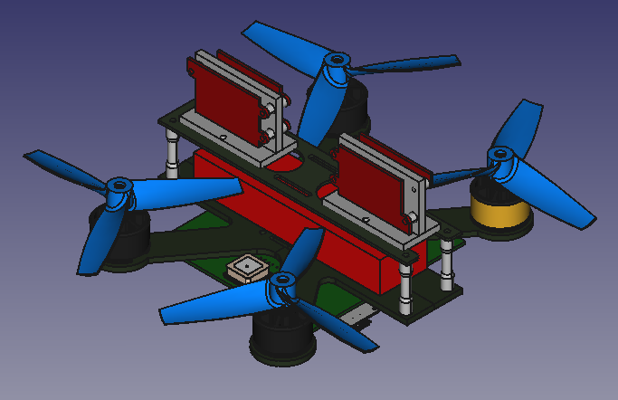
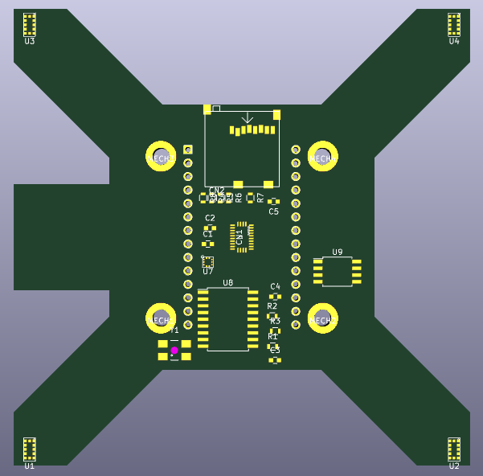
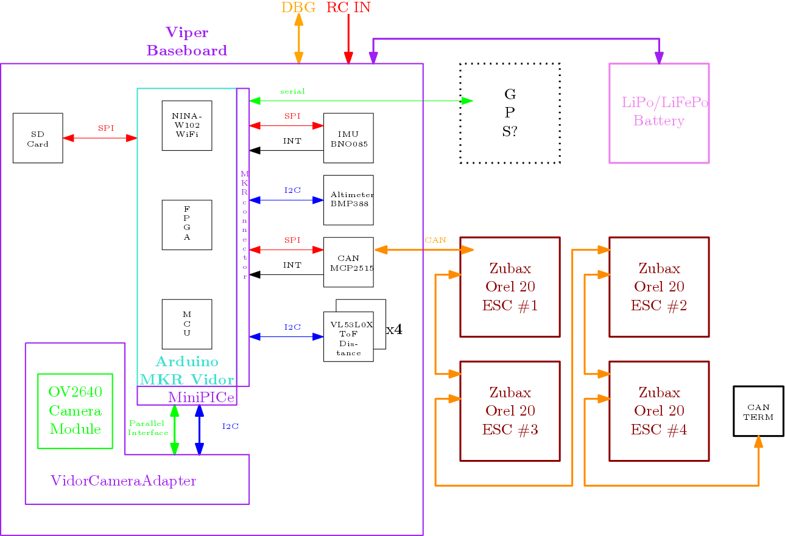

ViperBaseboard
==============

  

This repository contains the requirements and the hardware design for MKR Vidor 4000 based Viper quadcopter.

## Quadcopter renderings

## PCB renderings

The **Viper Baseboard** serves as an adapter board between an Arduino MKR Vidor 4000 and various sensors and actuators in order to implement a flight controller for a quadcopter UAV.

The block diagramm has been created using [Ipe](http://ipe.otfried.org/) which can be installed via `sudo apt-get install ipe texlive-full` or `sudo apt-get install ipe texlive-base texlive-latex-recommended` for minimal installation).

## Requirements
### Functional Requirements
#### Rotational/Translational Stabilisation
The quadcopter should be able to stabilise itself against external disturbances concerning its orientation and position with respect to a given setpoint. For determining the current orientation of the quadcopter a suitable Inertial Measurement Unit (IMU) with a suitable sensor fusion algorithm shall be used. For determining translational stabilisation a optical flow sensor consisting of a downward facing camera in combination with a suitable optical flow sensor algorithm shall be used.

#### Vertical (Height) Stabilisation
The quadcopter should be able to hold a set distance over ground. In close proximity to the ground VL53L0X ToF sensors are used to  determine the distance between ground and quadcopter and prevent an accidential crash. When the distance between quadcopter and ground exceeds the maximum measurement range of the ground sensors the height will be controlled using a digital altimeter such as the BMP388.

#### WiFi based Control/Configuration
The quadcopter shall provide a WiFi access point to which a WiFi capable device can connect. Once a WiFi connection is established the quadcopter can be controlled via commands exchanged between quadcopter and device via a network socket. A webserver will run on the quadcopter which allows the user to configure and tweak certain aspects of the quadcopter configuration (e.g. control parameters) or read out quadcopter status.

#### Automonous Landing
The quadcopter should be able to land without user control. Three VL53L0X ToF sensors arranged in a triangle are used to determine the distance between ground and quadcopter and also perform an estimation of the grounds surface.

#### FPV (First-Person-View) Control
The image stream of a forward facing camera (a MIPI connector intented for use with the Omnivision OV5647 camera is available on the MKR VIDOR 4000 board) should be suitably encoded (in the FPGA) and transmitted via WiFi module in such way that a user can be view the image stream e.g. on a mobile phone which allows a FPV control of the quadcopter.\
It should be posible to switch the FPV from forward facing camera to ground facing camera and back. Then the user can choose which camera fits best his needs.

#### SD Card Storage
There should be a socket for a SD card on the baseboard. The flight controller then can log information like position or altitude or store video clips of the cameras or do image generation like map creation with the ground facing camera.

### Sensors
#### VL53L0X
The VL53L0X ToF Sensor allows a measurement range of up to 2 m with a resolution of 1 mm.\
**Attention:** all VL53L0X come up with the same I2C address. So we need additional circuitry to disable them with the XSHUT pin und give them individual addresses one after another.
#### BMP388
The BMP388 is a precision barometric pressure sensor wich relative accuracy of 8 Pascals, which translates to about ± 0.5 meter of altitude.
#### BNO085
The BNO085 contains 3 axis accelerometers, gyroscopes and magnetometers incl. onboard-algorithms for sensor fusion.
#### CD-PA1010D (Optional)
The [CD-PA1010D](doc/datasheet/Sensor-GPS-CD-PA1010D-v-0-3.pdf) is global positioning sensor supporting GPS, GLONASS, GALILEO, QZSS which can be interfaced both via UART and I2C.

### Actuators
#### Zubax Orel 20 ESCs
[Zubax Orel 20](https://kb.zubax.com/display/MAINKB/Zubax+Orel+20) are used as ESC (Electronic Speed Controllers) and controlled via [UAVCAN](https://uavcan.org).

### Electrical Requirements

* **Input Voltage**: 9 - 18.5 V (same as the Zubax Orel 20).
* **Input Protection**: Input voltage should be protected by a TVS diode against voltage spikes from the motors.
There is no fuse because the motor drivers can draw excessive currents. Then a fuse is useless because it should have a very high current rating and then it can'tprotect very much. Additionally the fuse would add additional weight and empose a risk of failure during flight.

#### Power planes and distribution
* **Input Voltage**: to motor drivers and input for voltage regulators, current: 20 to 30 A.
* **5V**:
Input for Arduino because the Arduino doesn't like to be directly fed with 3.3V.
generated on by a switching regulator.
Current: 500 mA + Current for 3.3V devices
* **3.3V**:
for sensors and camera module
generated by the onboard regulator of the Arduino
Current: up to 100 mA, should be OK for the onboard regulator

#### Connectors (mechanical and pinout)
##### Battery / Input
##### CAN
The Zubax Orel 20 ESCs utilize the [JST GH](http://www.jst-mfg.com/product/detail_e.php?series=105) connectors with a pitch of 1.25 mm.

| **Pin** | **Signal** |
|:-------:|:----------:|
| 1       | VCC        |
| 2       | CAN_H      |
| 3       | CAN_L      |
| 4       | GND        |

#### Connections of Arduino MKR Vidor 4000

* **MKR connector** (2.54 mm pinheader, 28 pins)
  * I2C
  * CAN over SPI (like on MKRCANShield)
  * 5V input, 3.3V output
  * RC_IN (for additional remote control receiver)

| **Pin** | **Pin Name** | **Signal**    | **Description**                |
|:-------:|:------------:|:-------------:|:------------------------------:|
| 1       | AREF         | not connected |                                |
| 2       | DAC0/A0      |               |                                |
| 3       | A1           |               |                                |
| 4       | A2           |               |                                |
| 5       | A3           |               |                                |
| 6       | A4           |               |                                |
| 7       | A5           |               |                                |
| 8       | A6           |               |                                |
| 9       | D0           | RC_IN         | remote receiver input          |
| 10      | D1           |               |                                |
| 11      | D2           |               |                                |
| 12      | D3           | MCP2515_CS    | like MKRCANShield              |
| 13      | D4           |               |                                |
| 14      | D5           |               |                                |
| 15      | D6           |               |                                |
| 16      | D7           | MCP2515_INT   | like MKRCANShield              |
| 17      | D8/MOSI      | MOSI          | MCP2515                        |
| 18      | D9/SCK       | SCK           | MCP2515                        |
| 19      | D10/MISO     | MISO          | MCP2515                        |
| 20      | D11/SDA      | SDA           | I2C for sensors                |
| 21      | D12/SCL      | SCL           | I2C for sensors                |
| 22      | D13/RX       | GPS_RX        | communication with gps module  |
| 23      | D14/TX       | GPS_TX        | communication with gps module  |
| 24      | RESET        | not connected |                                |
| 25      | GND          | GND           |                                |
| 26      | 3V3          | 3V3-rail      | supply voltage for sensors ... |
| 27      | VIN          | 5V            | input from voltage regulator   |
| 28      | 5V           | not connected |                                |

* **USB**: Programming and debugging
* **I2C**: Not used, redundant to MKR connector
* **LiPo**: not used, not suitable
* **MicroHDMI**: not used
* **MiPi Camera Connector**: reserved for front facing camera
* **MiniPCIe Connector**: Connection to OV2640 camera module serving as optical flow sensor. Using VidorCameraAdapter.

### Mechanical Requirements

* **Mounting**: No enclosure planed.
* **Mounting**: There should be mounting holes to mount the baseboard on the [Armattan F1-4B 3MM frame](https://www.armattanquads.com/f1-4b-3mm/)
* **Weight**: The weight should be as low as possible to get better flight performance
* **Cameras**: One camera is mounted on the botom and is facing to the ground. There is an option for a second camera facing forward.

### Environmental Requirements

* **Temperature**: Commercial temperature range should be OK. But parts with industrial range are preferred because of higher reliability.
* **Shock/Vibration**: Care should be taken because of higher vibration on copter therefore no high parts like electrolytic capacitors

